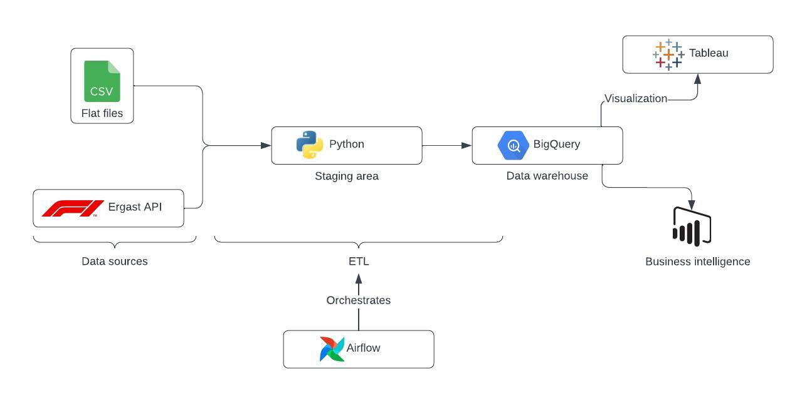
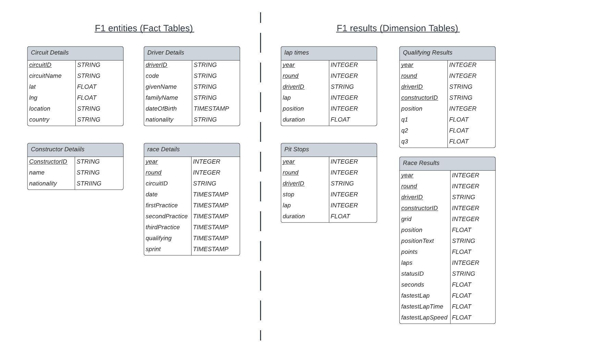

# Formula 1 Data Warehousing and Real Time Insights

Data is extracted from flat files and Ergast API, then staged and transformed in Python for further processing. Subsequently, this data is loaded into a BigQuery data warehouse. This entire workflow is managed and orchestrated in Airflow. Once the data is prepared, it can be utilized for visualization in Tableau and for deriving insights.

The data warehouse schema is structured as follows:

In progress:

- Setting up ETL for the fact tables
- Tableau dashboards
- Insights from exploratory data analysis and Machine learning models